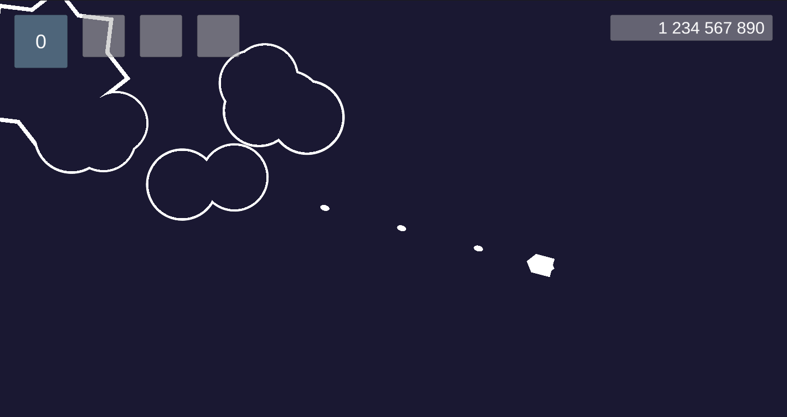
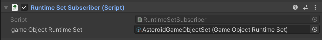
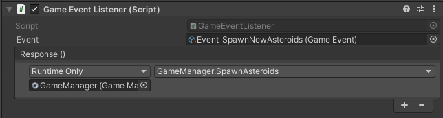
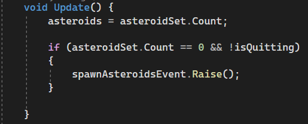
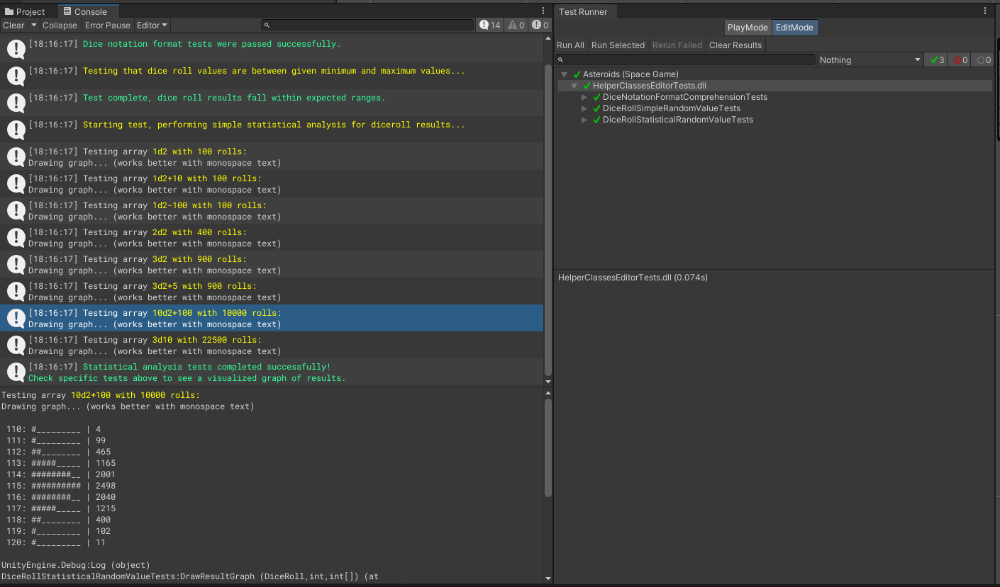

# Space Game: Asteroids
 
 

 An asteroids clone, potentially with some progression elements down the line. 

 # Project goals

 This project is a practice project where I learn what's new in Unity since 2016 or so. Some of my personal learning goals were: 

 1. Learning about Scriptable Objects
 1. Becoming more familiar with the C# event system
 1. Learning about writing C# tests for a Unity project
 1. Learning about new programming patterns 
 1. Learning new and recommended UI workflows 
 1. Learning new and recommended Input workflows
 1. Learning about other new and recommended Unity workflows, systems and changes
 1. Becoming more familiar with selecting the most suitable programming patterns for Unity projects
 1. Becoming more familiar with using Git version control with Unity projects

## Scriptable Objects

This is the first project where I used Scriptable Objects. I generated new base Scriptable Object classes, and use them to hold information about various game objects, such as player-controlled ship's basic stats, and stats of different types of weapons and asteroids.

I also use some of the features explained in the Unite 2017 talk (Game Architecture with Scriptable Objects)[https://www.youtube.com/watch?v=raQ3iHhE_Kk].

### Runtime Sets

	I'm using Runtime Sets as a type of decoupled runtime lists of objects that exist in the game, which can be defined and renamed by designers (without writing extra code), and can be easily plugged in to multiple components of different objects without causing extra dependencies. 
	
	When an object is made to use a specific runtime set, it's added to a list of objects of that set, which can be later referenced on other scripts and components. For example, it can be used to keep track of the number of asteroids on the screen, but also types of specific asteroids (e.g. metal asteroids) on the screen. 

I also use Scriptable Objects in the event system, described below. 

## C# Event System

This is the first project where I designed its event system architecture myself; earlier, I've only been the 3D artist or at most a support programmer on projects using C# events. 

Instead of default Unity events, I ended up mostly using event "channels" based on Scriptable Objects, which make it easy to make modular, extendable and with automatically managed dependencies. 

Events are assets in the asset folder that can be added to GameObjects, and which can be used to call specific functions of the game object's components by using Unity's built-in event system.

Example code that raises an event when there are no asteroids left on the screen.

## C# Tests

I learned about writing basic tests for Unity using Unity's Test Framework package and TestRunner. 

### Diceroll tests

I wrote a few different tests for the DiceRoll helper class which takes a string and outputs a random number based on the parameters defined by the string, using the tabletop RPG diceroll notation. 

<video controls="" width="800" height="500" muted="" loop="" autoplay="">
<source src="./GitDocs/diceroll_unity_tests.mp4" type="video/mp4">
</video>

For example, e.g. "1d6" generates a random number from 1 to 6 (inclusive), and 2d6 generates two numbers 1-6 and sums them together, giving a total range or results from 2 to 12, with 7 being the most common result.

The tests check that the string is interpreted correctly, that the generated random numbers are within the expected minimum and maximum range, and perform a simple repeated result test which outputs a representation of the relative likelyhood of the various results (as a Gaussian curve).