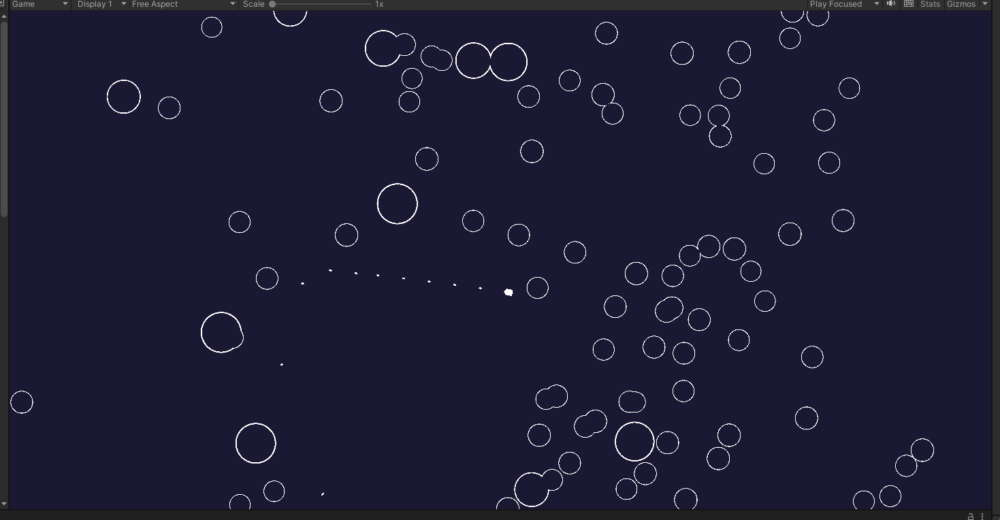
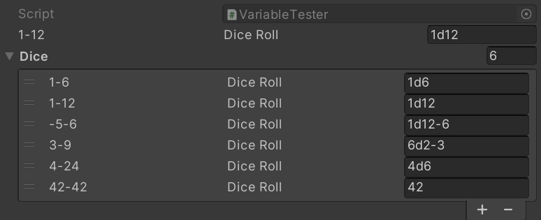
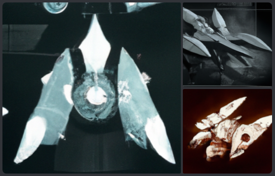
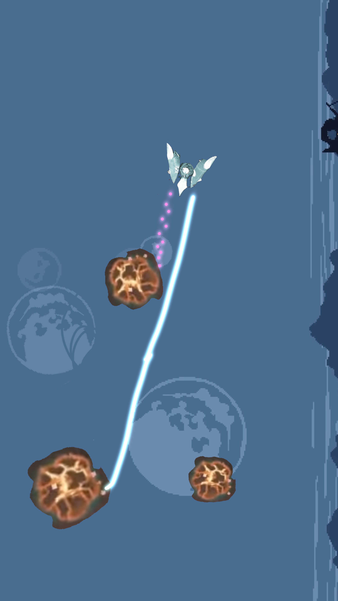

# Space Game: ASTEROIDS
## version history (2023)

### 0.1.03
Feb 20th

I implemented a simple UI system, using a multi-scene setup where the UI system lives on its own, separate Unity scene. This way, in a group project, the UI and the actual game scene(s) can be worked on separately without locking the scene or causing merge conflicts. 

The UI is a placeholder without actual functionality. However, it does interact with the Scriptable Asset based event system. 

### 0.1.01
Feb 9th

Among other things, I looked into more complex test systems and wrote a C# test that analyzes whether the random dice rolls (in the tabletop RPG format, e.g. 1d6 or 2d6+8 or 3d11-3) actually returns every possible combination. 

Since the dice rolls are random, this is not a pure unit test, and it relies on repeating the dicerolls hundreds or thousands of times so that statistically, it's likely that even the unlikely values are returned at least once. This test would fail with dicerolls with a huge variability, such as 10000d10000, and it can occassionally fail even with the current set of tests (even though that's statistically unlikely).

To visually represent this to the user, I made a simple ASCII chart drawer that creates an ASCII representation of the resulting gaussian probability curve and shows how many times each value appeared in the test set.

### 0.0.06
Jan 27th

I implemented a simple zooming system and fixed issues this raised with the screen wrap system. 

This can be considered to be the game's first progression mechanic, where tehe game area grows as the player destroys more asteroids. 

I also made a few different types of asteroid prefabs with different values and stats. 

### 0.0.05
Jan 26th

At this point I had already implemented basic scriptable objects and tests and had started working on the event system. 

Gameplay-wise, the only addition from January 13th is the fact that asteroids can now be destroyed. However, many of the underlying systems had been rewritten and tweaked in various ways while I was experimenting with the new systems, programming patterns and workflows. 

### 0.0.04
Jan 20th

I worked on various helper classes and systems, including a dice notation system that lets the designer type in a string that Unity interprets as instructions to generate a random number. 

The notation uses the tabletop dice-rolling notation where 1d6 is random number from 1 to 6 (inclusive), 2d6 is two random numbers 1-to-6 summed together for a range of 2 to 12 where the value of 7 is most likely and values of 2 and 12 are quite unlikely. 

### 0.0.03
Jan 13th

I added a few more basic game systems including destructible asteroids and screen wrap, where objects that exit the screen from the right side can re-enter the game from the left. 

### 0.0.02
Jan 10th 2023

### Concept and planning
December 2022 to mid-January 2023

I simplified an earlier idea of a sapce shooter with some progression elements into an Asteroids clone (with the potential for some progression elements to be added to it later).

Some of the very basic concepts were generated using Dall-E 2 and with photobashing using partial screenshots from other games including Dome Romantic.

